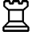
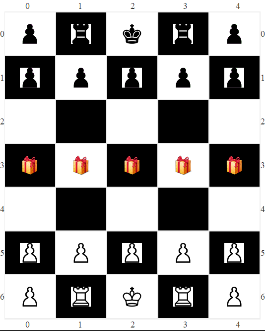

<H1> TUC Chess AI agent</H1>
This repository holds the enviroment and the agent of TUC-CHESS that was designed and developed for the purposes of the course "Artificial Intelligence" during the 2022 year, it was created by myself and Manesiotis Thanasis. 

The functionality of the environment was provided to us for the purposes of the project. It is similar to conventional chess, but is modified to different functionality, it uses the dimensions of 5x7 it generates random prizes, has special rules, such as 4 second time restriction per move.

There are 2 different approaches on the way the agent makes desicions.

The first one is using the Min-Max algorithm with an extension of alpha beta pruning, to reduce the search space and enable it to search deeper inside the tree structure.

The second game playing logic was created by implementing the algorithm of Monte Carlo Tree search with an Upper Confidence bound.
<H2> Board and Pieces</H2>

The pieces found in this special chess are the following:

- ,  A king = 8 points 
-   7 pawns = 1 point each 
-   2 rooks = 3 points each
-  and prizes, that are neutral = 1 point each

The starting position of all the pieces is present in the image below:

<H2>Rules of the Game</H2>
As with classical chess, this chess is also turn based and following the tradition of chess, the white player plays the first move.

<H3>Winning condition:</H3>
The winner at the end of the game is the one with the most points. 

Every game ends when:
- A king is captured
- There are no other pieces except the two kings
- The pre-defined time limit is reached

A player can gather points by:
- **Capturing enemy pieces:** Capturing an enemy piece gives points equal to their value. 
- **Collecting prizes:** Collecting a prize gives 1 point with 95% propability, and 0 points otherwise.
- **A pawn reaches the end of the board:** The pawn vanishes and give 1 point to the player

Prizes appear randomly after a players moves a piece on the board. 

Movement of the pieces:
- **Kings**: Move 1 square to any direction 
- **Pawns**: Move 1 square only towards the opposing side
    - Vertically when there is an empty square or a prize and
    - Diagonally by capturing an enemy piece
- **Rooks**: Move at most 3 squares horizontally or vertically

<H2> Installation </H2>
Download the .jar file to get the application and then double click, to play with the application

